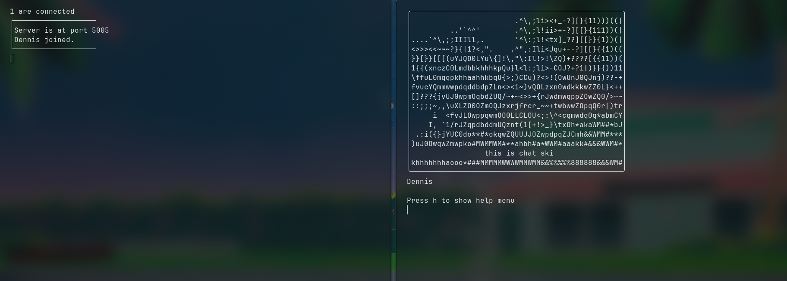

<div align="center">
  
</div>
<p align="center">A terminal-based ASCII video chat application.</p>
<div align="center">
  
</div>

## Features

- Real-time webcam to ASCII art conversion
- UDP-based peer broadcast via a lightweight relay server
- Live microphone volume affects ASCII shading dynamically
- Speech-to-text subtitles overlaid on your video feed
- Box-drawn terminal UI showing your feed and all connected users
- Simple TOML config (username, server IP, port)


## Requirements

Python 3.11+ is recommended. Install dependencies with:

```bash
pip install pillow sounddevice numpy SpeechRecognition opencv-python readchar tomli-w
```

You will also need `portaudio` installed on your system for `sounddevice` to work:

- **Arch:** `sudo pacman -S portaudio`
- **Debian/Ubuntu:** `sudo apt install portaudio19-dev`
- **macOS:** `brew install portaudio`

---

## Running the Server

On the machine that will relay frames between clients:

```bash
python server.py
```

The server listens on port `5005` by default (UDP, IPv6 with IPv4-mapped address support). It logs connections and disconnections in a simple terminal UI.

---

## Running the Client

```bash
python main.py
```

On first run (or if no config is found at `~/.config/chatski/client.toml`), you will be prompted to enter:

- A username
- The server IP address
- The server port

The config is saved automatically and reused on subsequent runs. Press `c` at any time to reconfigure.

---

## Controls

| Key | Action |
|-----|--------|
| `h` | Toggle help menu |
| `d` | Toggle dynamic shading (volume-reactive ASCII) |
| `m` | Toggle microphone mute (disables subtitles and volume shading) |
| `c` | Reconfigure (username, server IP/port) |
| `q` | Quit |

---

## How it Works

### ASCII Conversion (`image.py`)

Each webcam frame is resized to a max of 50x50 characters, then each pixel's brightness is mapped to a character in the palette:

```
$@B%8&WM#*oahkbdpqwmZO0QLCJUYXzcvunxrjft/\|()1{}[]?-_+~<>i!lI;:,"^`'. 
```

When dynamic shading is enabled and the microphone volume exceeds a threshold, the brightness of each character is boosted proportionally, making the ASCII image "pulse" with audio.

### Subtitles (`image.py`)

A background thread continuously listens via the microphone and uses Google Speech Recognition to transcribe speech. The latest transcription is overlaid in your ASCII frame.

### Networking (`net.py`, `server.py`)

Clients send their ASCII frame and username to the server as a JSON UDP packet every loop iteration. The server rebroadcasts each client's data to all other connected clients. A ping/pong mechanism detects disconnections after 3 seconds of silence.

The socket uses IPv6 with `IPV6_V6ONLY` disabled, so standard IPv4 addresses work via `::ffff:` mapping. (which is automatically added in config so no need to add)

---

## Known Limitations

- The `recvfrom` buffer in `net.py` is set to 1024 bytes, which may truncate large frames at higher resolution. Increase if needed.
- Speech recognition requires an internet connection (Google Speech API).
- The server has no authentication; anyone with the IP and port can connect.
